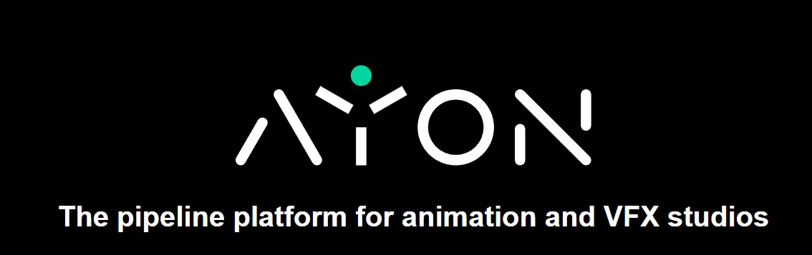
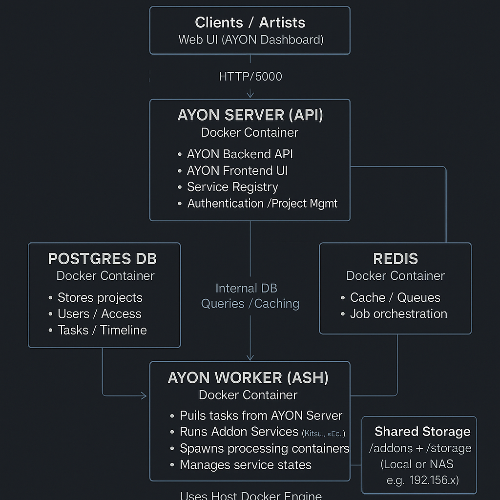

# 🚀 AYON Production Deployment (Ubuntu 24.04 + Docker)

This repository contains the full production-ready deployment of **AYON Server**  
for Monkeys VFX Studio using **Ubuntu 24.04 LTS + Docker + Docker Compose + ASH Worker**.

This setup is engineered following DevOps best practices:
- Secure installation  
- Clean reproducible deployment  
- Service worker (ASH)  
- Shared storage mount (NAS via CIFS)  
- Addons ready (Kitsu Processor example)  
- Health-checks  
- Fully documented troubleshooting  
- Upgrade & backup strategy  

---

# 📌 1. Overview

AYON is an open-source production management system for VFX, Animation, and CG pipelines.  
This repository delivers a **clean, stable, production deployment** including:

- AYON Server (API + Web UI)
- PostgreSQL 15
- Redis Cache
- ASH Worker (Background services launcher)
- External NAS mounted as shared storage
- Full Docker stack
- Auto-start on reboot

  


---

# 🏗 2. Architecture Diagram



---

# 🧱 3. Components

| Component | Role |
|----------|------|
| **AYON Server** | Main API + Web UI + Addons |
| **PostgreSQL 15** | Main DB for entities/projects |
| **Redis** | Cache + background operations |
| **ASH Worker** | Launches services (e.g., Kitsu Processor) |
| **NAS Storage** | Stores project files (via CIFS mount) |
| **Docker Compose** | Orchestrates the full stack |

---

# ⚙️ 4. Requirements

| Requirement | Version |
|------------|---------|
| Ubuntu | 24.04 LTS |
| Docker | 27+ |
| Docker Compose | 2.27+ |
| RAM | 8–16GB recommended |
| Disk | 200GB+ for storage/projects |
| Network | Static IP |

---

# 🔧 5. Installation Steps

## (A) System Update
```bash
sudo apt update && sudo apt upgrade -y
sudo reboot
```

---

## (B) Install Docker (Official Script)
```bash
curl -fsSL https://get.docker.com -o get-docker.sh
sudo sh get-docker.sh
sudo systemctl enable docker
sudo systemctl start docker
```

---

## (C) Install Docker Compose v2
```bash
mkdir -p ~/.docker/cli-plugins
curl -SL https://github.com/docker/compose/releases/download/v2.27.1/docker-compose-linux-x86_64 \
  -o ~/.docker/cli-plugins/docker-compose
chmod +x ~/.docker/cli-plugins/docker-compose
docker compose version
```

---

## (D) Clone AYON Deployment
```bash
git clone https://github.com/YOUR-USERNAME/ayon-production-deployment.git
cd ayon-production-deployment
```

---

# 🐳 6. Docker Compose Configuration

## docker-compose.yml
(Production version used in Monkeys VFX)

```yaml
services:
  postgres:
    image: postgres:${AYON_STACK_POSTGRES_TAG:-15}
    restart: unless-stopped
    healthcheck:
      test: ["CMD-SHELL", "pg_isready -U ayon"]
      interval: 5s
      timeout: 5s
      retries: 5
    expose: [5432]
    volumes:
      - "/etc/localtime:/etc/localtime:ro"
      - "db:/var/lib/postgresql/data"
    environment:
      - "POSTGRES_USER=####"
      - "POSTGRES_PASSWORD=####"
      - "POSTGRES_DB=####"
      - TZ=Africa/Cairo

  redis:
    image: redis:alpine
    restart: unless-stopped
    healthcheck:
      test: ["CMD-SHELL", "redis-cli ping | grep PONG"]
      interval: 5s
      timeout: 5s
     retries: 5
    expose: [6379]

  server:
    image: ynput/ayon:latest
    restart: unless-stopped
    healthcheck:
      test: ["CMD", "curl", "-f", "http://localhost:5000/api/info"]
      interval: 10s
      timeout: 2s
      retries: 3
    depends_on:
      postgres:
        condition: service_healthy
      redis:
        condition: service_started
    expose: [5000]
    ports:
      - "5000:5000"
    volumes:
      - "./addons:/addons"
      - "./storage:/storage"
      - "/etc/localtime:/etc/localtime:ro"

  worker:
    image: ynput/ayon-ash:latest
    hostname: worker
    restart: unless-stopped
    network_mode: host
    depends_on:
      - server
    volumes:
      - "/var/run/docker.sock:/var/run/docker.sock"
    environment:
      - "AYON_API_KEY=YOUR_SERVICE_USER_KEY"
      - "AYON_SERVER_URL=http://SERVER_IP:5000"

volumes:
  db: {}
```

---

# 🚀 7. Deploy the Stack

```bash
docker compose up -d --build
```

Verify:

```bash
docker ps
```

AYON should now be available at:

👉 **http://SERVER_IP:5000/onboarding**

---

# 🧩 8. ASH Worker (Service Host)

ASH automatically runs background services like:

- Kitsu Processor  
- Ftrack Processor  
- Webpublisher  
- Custom pipelines  

Worker appears under:

**Admin Panel ➝ Services ➝ Hosts**

Example:

```
worker (online)
cpu: 2.1%
ram: 9.8%
services running: kitsu processor
```

---

# 📁 9. Storage Mount (NAS / SMB)

Mount shared project storage:

```bash
sudo mkdir -p /mnt/share
sudo mount -t cifs //192.168.1.247/Projects /mnt/share \
  -o username=####,password=####,domain=####,rw,vers=3.0,sec=ntlmssp
```

Permanent mount `/etc/fstab`:

```
# NAS Storage for AYON
//192.168.1.247/Projects  /mnt/share  cifs  username=####,password=####,domain=####,vers=3.0,sec=ntlmssp,rw  0  0
```

---

# 🔄 10. Backup Strategy

## Backup DB
```bash
docker exec -t ayon-docker-postgres-1 pg_dump -U ayon > ayon_$(date +%F).sql
```

## Backup Images
```bash
docker save -o ayon_all_images.tar \
  ynput/ayon:latest \
  postgres:15 \
  redis:alpine \
  ynput/ayon-ash:latest \
  ynput/ayon-kitsu-processor:1.2.5
```

## Backup storage
```
/home/ayon-docker/storage/
```

---

# 🛡 11. Security Hardening (Recommended)

- Move AYON behind Nginx Reverse Proxy + HTTPS  
- Change service API keys every quarter  
- Use firewall: allow (22, 445, 5000 only internally)  
- Disable root SSH login  
- Use fail2ban  

---

# 📈 12. Monitoring Setup (Optional)

Recommended stack:

- Netdata  
- Grafana + Prometheus  
- Docker Metrics Dashboard  
- AYON built-in admin tools  

---

# 🐞 13. Troubleshooting

### Container cannot start:
```
docker compose logs -f
```

### Worker host appears twice
Run inside Postgres:
```sql
DELETE FROM hosts WHERE name='OLD_HOSTNAME';
```

### Wrong timezone inside server
Add:
```
- TZ=Africa/Cairo
```
To every service.

---

# 🧩 14. Folder Structure

```
ayon-production-deployment/
│── addons/
│── storage/
│── docker-compose.yml
│── docker-compose.override.yml   (optional)
│── images/
│── scripts/
│── architecture.png
│── README.md
```

---

# 🟢 15. Screenshots (To be added after deployment)

- AYON Dashboard  
- Services Overview  
- Worker Status  
- Kitsu Integration  
- Projects Demo  

---

# 🎯 Final Notes

This deployment is now production-ready and used internally in **Monkeys VFX Studio**  
with ASH worker, addons, storage mount, system hardening and automated backups.

Pull requests and improvements are welcome!

